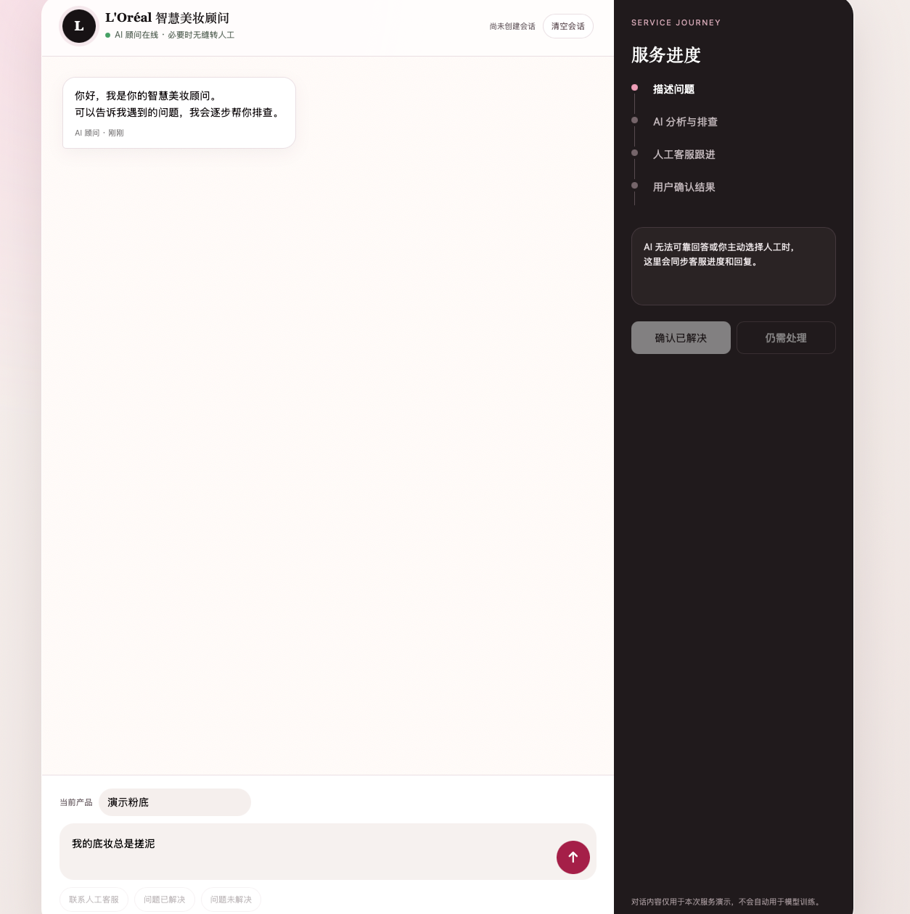
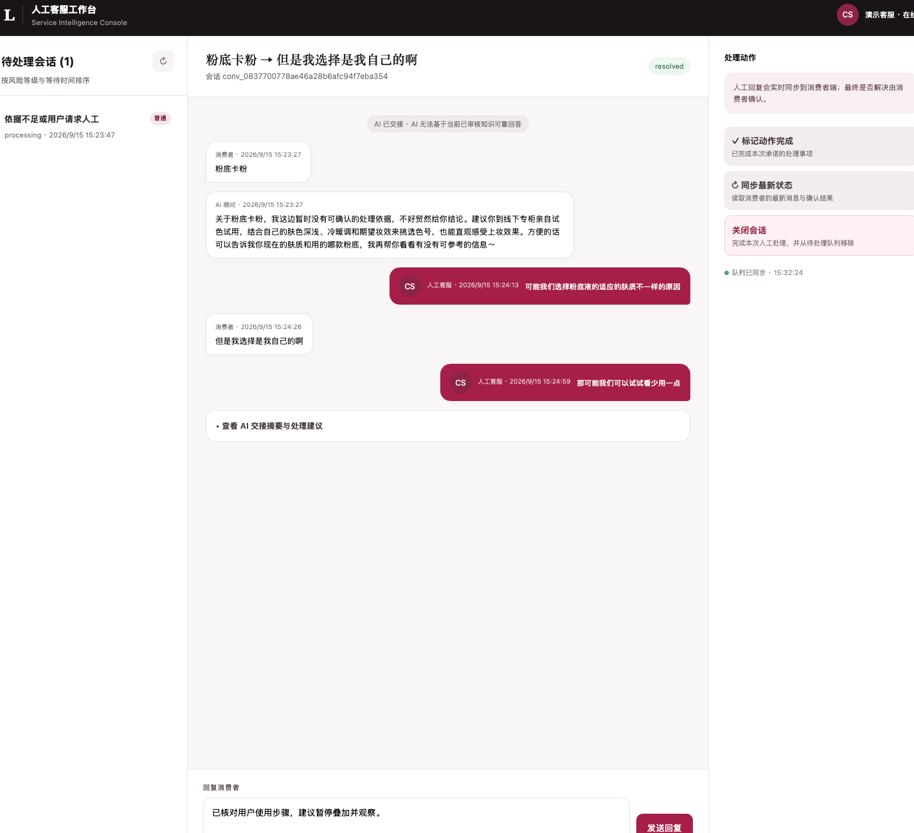

# L'Oréal AI Service Intelligence

面向美妆消费者咨询、风险识别、人工接管和服务洞察的 AI service intelligence backend。
当前实现采用 FastAPI、MongoDB、可替换的 `IntentProvider`/`KnowledgeProvider` 和确定性安全
fallback，可在没有外部 LLM 的情况下运行完整演示流程。

## 环境要求

- Python 3.9+

## 快速开始

```bash
scripts/bootstrap.sh
scripts/demo-start.sh
```

首次运行 `bootstrap.sh` 会创建 `.venv`、安装 dependency，并由 `config/local.example` 创建不会被
Git 追踪的根目录 `.env`。该 `.env` 只保存可选 LLM 接入配置，其他功能使用代码默认值；
`demo-start.sh` 会启动或复用本地 MongoDB、启动 API，并在 macOS 自动打开消费者端和客服端页面；
按 `Ctrl+C` 可停止本次启动的进程。

如果需要分别启动：

```bash
scripts/mongo-dev.sh  # terminal 1
scripts/dev.sh        # terminal 2
```

服务启动后可访问：

- 消费者端：<http://127.0.0.1:8000/workspace/consumer>
- 人工客服端：<http://127.0.0.1:8000/workspace/agent>
- 健康检查：<http://127.0.0.1:8000/health>
- API 文档：<http://127.0.0.1:8000/docs>

建议演示流程：消费者端发起“底妆搓泥”咨询，补充一个关键条件，执行单条件建议并记录结果，然后确认
需要人工时由 AI/安全规则自动建单；客服端从自动刷新的队列查看双方已沟通内容、确认事实、尝试记录
和转人工原因，发送人工回复并记录动作完成；消费者端会自动显示回复，
并由消费者本人确认已解决或仍需处理。

完整的首次安装、启动故障排查和逐步演示操作见
[开发与演示指南](docs/development.md)。

## 界面预览

消费者端提供多轮 AI 咨询、主动转人工、服务进度、人工回复同步和问题结果确认：



人工客服端提供待处理队列、双方共享对话、AI 交接摘要、回复和关闭会话操作；关闭后会话移出队列，
消费者选择“仍需处理”后会重新进入待处理队列：



## 接入 LLM

真实模型通过 OpenAI-compatible adapter 参与意图理解和安全边界内的上下文话术生成。把以下值写入本地 `.env`，不要写进
`config/*.example`，也不要 commit：

```dotenv
LLM_ENABLED=true
LLM_API_KEY=your-runtime-secret
LLM_BASE_URL=https://your-provider.example/v1
LLM_MODEL=your-approved-model
```

timeout 和 retry 直接使用代码默认值。保存后重新运行 `scripts/demo-start.sh`。LLM 会结合最近对话、
当前意图、状态与已审核知识生成 `ASK`、`GUIDE`、`RESOLVE` 回复；`BLOCK` 和 `HANDOFF` 仍使用
确定性安全话术。模型输出非法或调用失败时自动回退模板。
最终状态、安全判断和持久化仍由 backend 控制，真实 RAG 尚未接入。详细配置和 fallback 见
[Configuration](docs/configuration.md)。

## 已实现能力

- 消费者多轮咨询及 `GUIDE`、`RESOLVE`、`ASK`、`HANDOFF`、`BLOCK` 状态编排；
  `GUIDE` 用于底妆搓泥单条件排查，`RESOLVE` 保留兼容既有通用咨询。
- Case 事实版本、更正与未知项，以及建议执行、跳过、观察和结果相互独立的 Attempt 记录。
- 当前消息优先的风险识别，支持常见否定、假设、第三方主体和已恢复表达。
- 可注入的 LLM 意图识别边界，以及 timeout、非法输出和低置信度 fallback。
- 可注入的 RAG/知识库边界，以及知识可回答性过滤和可追踪 evidence。
- MongoDB 会话、审计、反馈、幂等人工事件和客服动作持久化。
- 人工客服视图、事件队列和基础品牌洞察 API。
- Ticket 人工回复、动作完成、用户确认解决和重开事件，以及消费者/客服最小 web workspace。
- 可通过 HTTP 或 Python 调用的 typed AI Mock decision package，用于真实 AI 接入前联调。

当前附件只进行 metadata 校验；系统会明确告知无法读取内容并建议转人工。订单系统、真实文件
存储、登录鉴权和 webhook 等 external integration 尚未选型，不会在演示中伪造已接入状态。

完整 API contract 与演示边界见
[比赛 MVP API](docs/api.md)，实现结构见
[比赛 MVP Backend Architecture](docs/architecture.md)，4 号 P0 技术合同见
[系统架构与技术接口](docs/system-architecture-and-interfaces.md)。

## 质量检查

```bash
scripts/check.sh
```

演示前全链路模拟：

```bash
.venv/bin/python scripts/demo_smoke.py
```

## 项目结构

```text
src/loreal_ai_service_intelligence/
├── api/              # FastAPI application、route 与 Mock HTTP contract
├── domain/           # Pydantic domain model，不依赖 transport/provider
├── services/         # 会话状态机与业务编排
├── providers/        # LLM intent、上下文回复与知识检索边界和默认实现
├── infrastructure/   # MongoDB/Memory repository adapter
├── config.py         # 类型化 runtime settings
└── cli.py            # 本地 ASGI 启动入口
tests/                               # 自动化测试
docs/                                # 详细项目文档
config/                              # environment 配置
data/                                # 本地数据分层
sandbox/                             # 本地实验区
scripts/                             # 开发与验证脚本
```

## 开发规范

仓库级开发要求见 [AGENTS.md](AGENTS.md)，版本变更记录见
[CHANGELOG.md](CHANGELOG.md)，详细文档索引见 [docs/README.md](docs/README.md)。

config、data、sandbox 和 scripts 的完整说明见
[开发环境文档](docs/development.md)。

## 当前边界

内置规则与知识仅用于 deterministic demo，不代表 production 模型效果、真实商品知识或正式客服
SLA。上线前仍需完成真实 RAG、认证与 RBAC、文件处理、订单/售后系统、通知 webhook、分页、
事件认领和并发控制；具体风险和接入顺序见
[Backend Architecture](docs/architecture.md#production-接入路线)。
